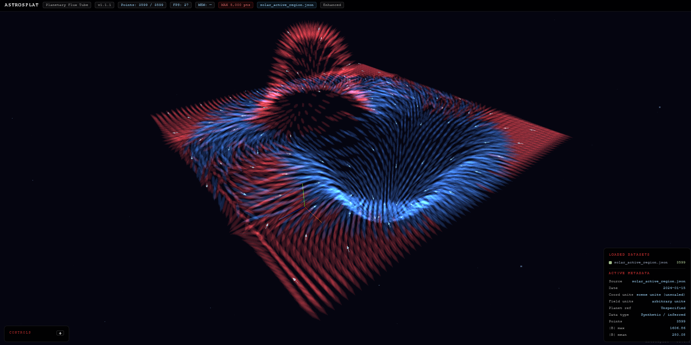
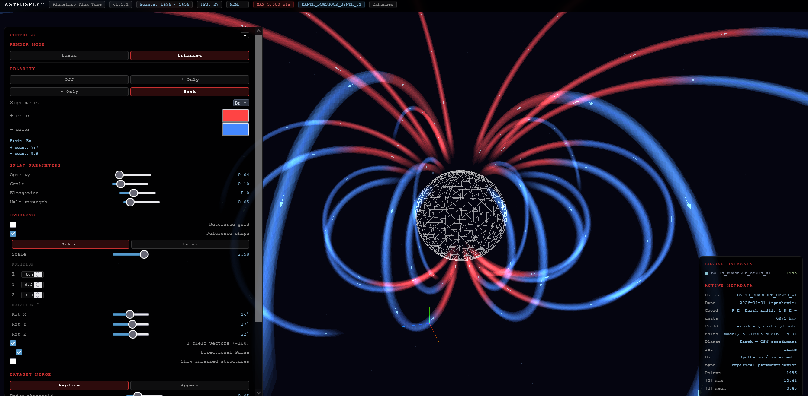
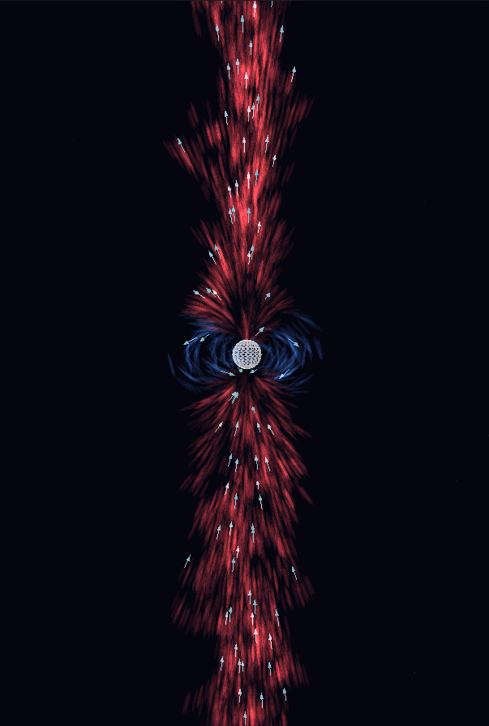

# AstroSplat

**Where data becomes structure**

[](https://doi.org/10.5281/zenodo.19377621)
[](LICENSE)
[]()
[]()

AstroSplat is a browser-native splat-based visualisation tool for astrophysical vector-field datasets. It is inspired by the perceptual strengths of splat rendering, but adapted for scientific field data rather than photogrammetric 3D reconstruction.

This release marks the **first stable visual milestone** of the viewer: corrected polarity-colour rendering, dual-layer splat realism, adjustable halo strength, reference-shape overlays with transform controls, and animated directional pulse for B-field vectors.

---

## What AstroSplat does

AstroSplat renders vector-field sample points as oriented volumetric splats in real time inside a browser, using Three.js and no backend.

It is designed to help users explore:

- magnetic-field structure
- polarity patterns in a chosen component basis
- volumetric organisation of sparse or structured field samples
- comparative visualisation across synthetic and future observational datasets

AstroSplat is a visualisation tool. It does **not** infer physical truth beyond the loaded data unless such layers are explicitly labeled as inferred.

---

## Current milestone: v1.1.1

This version includes:

- corrected polarity-colour rendering for selected field-component sign
- Basic and Enhanced render modes
- dual-layer splat realism with adjustable halo strength
- B-field vector overlay with optional **Directional Pulse**
- reference-shape overlay with:
  - Sphere / Torus options
  - scale control
  - anchor position controls
  - rotation controls
- collapsible control panel
- spatial-domain clipping and reset controls
- append/replace dataset merge workflow
- metadata panel and dataset identity display
- browser-native operation with no installation or build step

---

## Files

| File | Purpose |
|---|---|
| `AstroSplat.html` | Main browser viewer |
| `generate_magnetosphere.py` | Generates the Saturn polar flux tube dataset |
| `solar_to_splats.py` | Fetches or synthesises a solar active region dataset |
| `generate_earth_bowshock.py` | Generates the Earth magnetopause/bow shock dataset |
| `memory_guard.py` | JSON compression and RAM monitoring utility |
| `magnetosphere_data.json` | Saturn polar flux tube dataset |
| `magnetosphere_data_mini.json` | Reduced-precision Saturn variant |
| `solar_active_region.json` | Synthetic solar active region dataset |
| `earth_bowshock.json` | Synthetic Earth bow shock/magnetosphere dataset |

---

## Quick start

1. Open `AstroSplat.html` in a modern browser.
2. Load a dataset JSON file.
3. Use the left-hand controls to explore rendering, polarity, overlays, and reference geometry.

No installation required.

---

## Viewer capabilities

### Render modes

AstroSplat currently includes two viewer modes:

- **Basic**  
  Simpler splat presentation intended for clarity and speed.

- **Enhanced**  
  A more perceptual mode with stronger depth cues and a richer volumetric feel.

Both modes preserve the same underlying field data. Enhanced mode is a perceptual aid, not a physical radiative model.
## Screenshots

### Solar active region


### Earth bow shock


### Magnetosphere data

### Polarity rendering

AstroSplat can colour the scene by the sign of a selected field component basis:

- `Bx`
- `By`
- `Bz`

This means polarity currently answers:

> Is the selected component positive or negative at this point in the chosen coordinate frame?

It does **not** yet mean full magnetic topology, connectivity class, or radial polarity unless such modes are added in future versions.

### Halo realism

A dual-layer splat presentation is available:

- inner core = primary measured structure
- outer halo = softer support shell

The halo can be tuned with a **Halo Strength** slider and reduced to zero if a cleaner scientific view is preferred.

### B-field vectors

AstroSplat can display B-field direction vectors over the splat field.

The viewer also includes **Directional Pulse**, a small local animation that helps the eye read direction. This is a visual cue only, not a time-evolution simulation.

### Reference overlays

Reference overlays include:

- reference grid
- reference shape toggle
- **Sphere**
- **Torus**
- reference shape scale
- anchor position controls (`X`, `Y`, `Z`)
- rotation controls (`Rot X`, `Rot Y`, `Rot Z`)

These are visual alignment aids only and should not be interpreted as physically exact body models unless explicitly stated by the dataset.

### Spatial domain controls

The spatial-domain panel supports:

- clipping bounds
- preset-style domain workflow
- manual min/max control
- reset behaviour

This allows users to isolate regions of interest without modifying the source dataset.

### Dataset workflow

AstroSplat supports:

- **Replace** mode
- **Append** mode
- coordinate-proximity dedup threshold for merged scenes

Append mode is useful for exploratory multi-dataset comparison, but physical interpretation requires compatible coordinate systems and scales.

---

## Included datasets

### `magnetosphere_data.json`
Synthetic Saturn polar flux tube dataset used as a primary structural test scene.

### `solar_active_region.json`
Synthetic solar active-region dataset for testing field organisation near a photospheric surface.

### `earth_bowshock.json`
Synthetic Earth bow shock / dipole-style field dataset useful for polarity and reference-shape comparisons.

All included example datasets should currently be treated as synthetic or model-derived visualization datasets unless explicitly marked otherwise.

---

## Dataset JSON schema

Each point record should contain at least:

```json
{
  "x": 0.0,
  "y": 0.0,
  "z": 0.0,
  "Bx": 0.0,
  "By": 0.0,
  "Bz": 0.0,
  "intensity": 0.0,
  "gray": 128
}
````

Optional metadata/header records may also be included depending on the dataset format used by the viewer.

Current viewer behaviour uses:

* position for placement
* vector components for orientation and polarity basis
* grayscale/intensity-related fields for non-polarity default rendering paths where applicable

---

## Interpretation notes

AstroSplat is designed to be visually expressive **without inventing confidence that the data do not support**.

Important distinctions:

* **Measured / source structure** should remain primary.
* **Perceptual enhancements** such as halo, depth cues, and directional pulse are visual aids.
* **Polarity colouring** currently represents component sign, not a full topological classification.
* **Reference shapes** are alignment guides, not claims of exact physical scale.
* Future inferred layers should always be clearly labelled as inferred.

---

## Limitations

1. **Not Gaussian Splatting in the strict photogrammetric sense.**
   AstroSplat is a splat-based scientific viewer inspired by the visual strengths of splat rendering, but it is not a direct implementation of Gaussian Splatting for scanned 3D scenes.

2. **Current polarity modes are component-based.**
   They are tied to `Bx`, `By`, or `Bz` sign in the chosen coordinate frame.

3. **Enhanced mode is perceptual.**
   It improves the structure legibility but should not be interpreted as physical emission or plasma radiative behaviour.

4. **Reference shapes are schematic.**
   They assist orientation and comparison, but are not automatic physical fits.

5. **Append-mode interpretation depends on coordinate compatibility.**
   Merged datasets must share a meaningful frame and scale if they are to be interpreted physically.

6. **Included datasets are primarily synthetic/model-derived examples.**
   Real-time and measured data ingestion are future goals.

---

## Roadmap

### Near-term

* internal theme presets
* preset save/load workflow
* further panel organisation / collapsible sections
* finer realism tuning for splat edge behaviour

### Mid-term

* NOAA SWPC ingestion
* NASA CDAWeb ingestion
* true multi-frame sequence handling
* **Data Pulse** mode for actual time-resolved datasets

### Longer-term

* converter pipelines for additional scientific archives
* more polarity modes:

  * component polarity
  * radial polarity
  * outward/inward polarity
* SPARC conversion / galaxy-scale exploratory views
* explicit measured vs inferred structural layers

---

## Citation

If you use AstroSplat in research, teaching, outreach, or derivative work, please cite the repository release:

**Figueiredo, V. M. F.** (2026).
*AstroSplat: Browser-native visualization for astrophysical vector fields* (v1.1.1).
Zenodo. [https://doi.org/10.5281/zenodo.19377621](https://doi.org/10.5281/zenodo.19377621)

---

## License

MIT License

## Brand and trademark notice

The **AstroSplat** name, logo, slogan, and related branding identify the official project and are not licensed under the MIT License unless explicitly stated otherwise.

The MIT License applies to the repository’s **source code**. If you fork or redistribute modified versions of the software, please use your own project name and branding unless you have permission to use the official AstroSplat identity.

You are welcome to refer to AstroSplat factually, for example:

- “Based on AstroSplat”
- “Derived from AstroSplat”
- citations, reviews, comparisons, and academic references

Please do not use the AstroSplat name or logo in a way that implies official status, endorsement, or authorship of a modified fork.

See also [LICENSES.md](LICENSES.md) and [TRADEMARK.md](TRADEMARK.md) for asset-specific terms.


```
